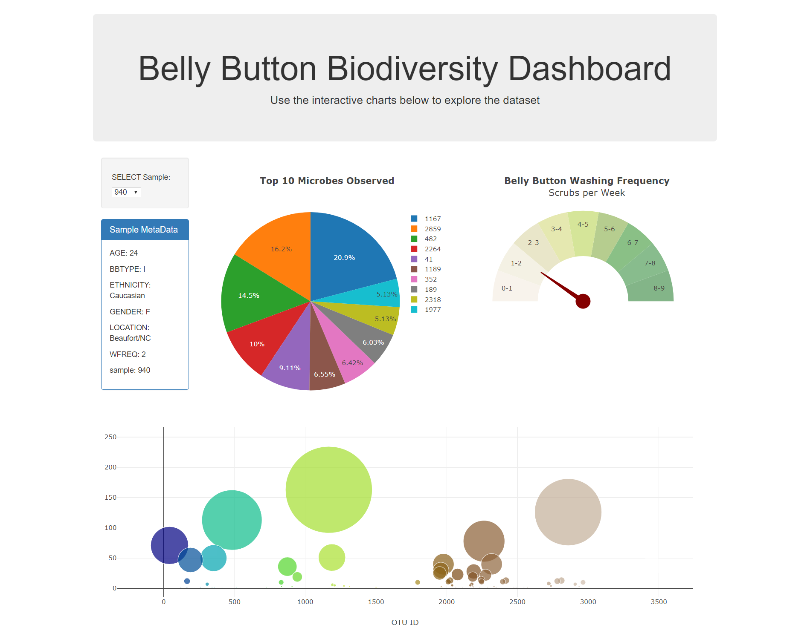

# Belly Button Biodiversity
Belly Button Biodiversity - Interactive Dashboard

**Description**  
HTML page, associated JavaScript files, and sqlite database that will create visualizations dynamically based upon user selection of sample number. Data used is from the [Belly Button Biodiversity Project](http://robdunnlab.com/projects/belly-button-biodiversity/). This app was also deployed using Heroku, and can be accessed [here](https://belly-button-biodiversity1.herokuapp.com/).

Dashboard displaying visualizations for currently selected sample from dropdown:  

**Contents**
* db/  
  * belly_button_biodiversity.sqlite  
  * bellybutton.sqlite  
* screenshots/  
  * dashboard.png  
* static/  
  * js/  
    * app.js  
    * bonus.js  
* templates/  
  * index.html  
* app.py